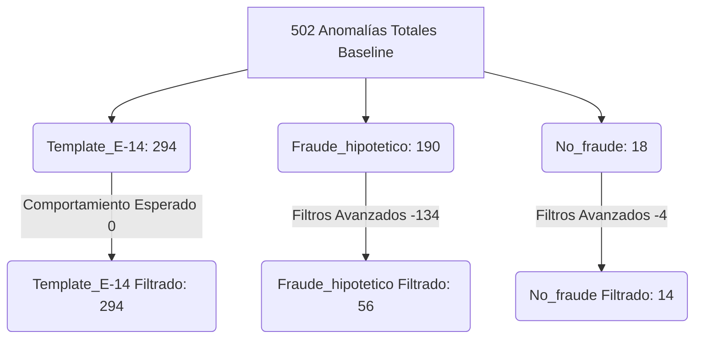

# Informe Técnico: Sistema de Detección de Anomalías en Formularios E-14
**Proyecto de Ciberseguridad y Auditoría Electoral — Elecciones Colombia**

---

## 1. Contexto del Problema

El formulario **E-14** (Acta de Escrutinio de Mesa) es el documento oficial y fundamental en el sistema electoral colombiano donde los jurados de votación registran manualmente los votos obtenidos por cada candidato y partido político. Estos formularios son posteriormente escaneados y digitalizados para su publicación y escrutinio oficial.

### El Desafío de la Integridad Electoral
Debido a la naturaleza manuscrita del diligenciamiento y a la velocidad con la que se realiza el conteo al cierre de las urnas, el proceso es susceptible a:
*   **Errores humanos de transcripción:** Números ilegibles, tachaduras o marcas erróneas.
*   **Adulteración intencionada (fraude):** Modificación de números para inflar votos (por ejemplo, añadir trazos para convertir un "1" en un "7", o agregar un "8" donde había un espacio vacío/punto).
*   **Ruido en la digitalización:** Pérdida de calidad por escaneo, desalineaciones de las páginas, sombras o interferencia física que dificultan la auditoría manual directa.

### Objetivos del Proyecto
Este proyecto aborda este desafío mediante el diseño y desarrollo de una herramienta automática basada en **Visión por Computadora (CV)** y **Aprendizaje Automático (ML)** capaz de:
1.  Ingerir y decodificar de forma masiva las actas E-14 (en PDF o imágenes extraídas).
2.  Localizar con precisión quirúrgica las casillas (slots) de votación basándose en plantillas de diseño.
3.  Clasificar cada dígito individual manuscrito y evaluar de forma probabilística su validez.
4.  Identificar patrones visuales atípicos (anomalías) que puedan sugerir manipulación de datos o adulteración, optimizando el sistema para minimizar los falsos positivos generados por el diseño gráfico del formulario preimpreso.

---

## 2. Metodología

El sistema utiliza un **enfoque híbrido** que combina la clasificación supervisada de caracteres con técnicas de detección de anomalías no supervisadas y heurísticas avanzadas basadas en análisis de componentes conexos.

### Arquitectura de Detección Multi-nivel
Cada casilla o "slot" de dígito del formulario es analizado de forma independiente a través de **6 niveles de verificación**:

```
      [ Slot de Dígito ]
              │
              ├──► 1. Score Isolation Forest (¿Outlier de píxeles?)
              ├──► 2. Entropía de Softmax (¿Incertidumbre en la predicción?)
              ├──► 3. Margen de Confianza Top-1 vs Top-2 (¿Confusión de dígitos?)
              ├──► 4. Conteo de Componentes Conectados (¿Trazos múltiples / Tachaduras?)
              ├──► 5. Relación de Aspecto (BBox Ratio) (¿Caracteres fusionados o fragmentos?)
              └──► 6. Filtros de Omisión de Falsos Positivos (Reglas de Seguridad)
```

1.  **Isolation Forest (Score de Anomalía):** Un algoritmo no supervisado entrenado únicamente con imágenes normales del dataset. Evalúa el vector de píxeles del slot (redimensionado a $32 \times 32$ y aplanado a 1024 dimensiones) y le asigna un score. Si el score es inferior al umbral (`--threshold`), el slot se marca como sospechoso.
2.  **Entropía de Predicción:** Mide la incertidumbre del clasificador de dígitos. Si la probabilidad predicha se distribuye uniformemente entre múltiples clases (entropía alta), indica ambigüedad visual en la escritura o posibles tachaduras.
3.  **Margen de Confianza:** Evalúa la diferencia entre las dos clases con mayor probabilidad. Un margen estrecho sugiere que el trazo puede ser un dígito modificado (por ejemplo, un "3" convertido en "8" mediante trazos adicionales).
4.  **Componentes Conectados:** Cuenta las agrupaciones de píxeles negros contiguos. En condiciones óptimas, un dígito limpio consta de 1 componente (o máximo 2 en casos como el "i" o el "dot"). Un número inusualmente alto de componentes indica fragmentación, ruido o trazos superpuestos.
5.  **Relación de Aspecto del Bounding Box (BBox Ratio):** Monitorea las dimensiones del dígito respecto al tamaño del slot.
    *   **Caracteres fusionados:** Si el trazo abarca más del 98% del ancho o alto de la casilla, es clasificado como fusión visual.
    *   **Fragmentos pequeños:** Si el trazo representa menos del 8% de la celda, se asume que es ruido de impresión o suciedad.

### Mitigación y Filtrado de Falsos Positivos (Reglas de Seguridad)
Para prevenir una alta tasa de falsas alarmas que inutilice la auditoría en entornos de producción, se implementaron reglas de filtrado avanzadas en [anomaly_detector.py](file:///c:/Users/scosb/Downloads/ProyectoFinalCiber/src/anomaly_detector.py):

*   **Dígito sobre Líneas (`_is_digit_on_lines`):** Si las dos predicciones más probables del clasificador incluyen un dígito válido y la clase `lines` (línea preimpresa), el sistema deduce que el dígito fue escrito directamente sobre la línea guía del formulario. Esta combinación se marca como **Segura** y se omite la anomalía.
*   **Punto sobre Líneas (`_dot_on_lines`):** Si la predicción es un punto de casilla vacía (`dot`) pero comparte probabilidad con `lines` (umbral $\ge 8\%$), se asume que representa un campo vacío preimpreso.
*   **Puntos Inciertos (`_dot_uncertain`):** Si la celda es clasificada como vacía (`dot`) con una confianza menor al $50\%$, se descarta la alerta de anomalía. Esto tolera variaciones de ruido de fondo sin generar alertas de fraude.
*   **Filtro de Componentes en Líneas Preimpresas:** Solo se alerta por múltiples componentes si la probabilidad de la clase `lines` es inferior al $15\%$. Si es superior, se asume que el segundo componente corresponde simplemente a la línea guía del formulario y no a una alteración.
*   **Tolerancia de Bounding Box (`max_bbox_ratio` = 0.98):** Se aumentó la tolerancia del tamaño máximo del carácter del 95% al 98% para evitar que las líneas guía impresas horizontales que cruzan horizontalmente los slots disparen falsos positivos de "caracteres fusionados".

---

## 3. Implementación y Guía del Sistema

El sistema está desarrollado en Python y se estructura de manera modular para separar la fase de procesamiento de imágenes de la fase de modelado matemático.

### Pipeline de Ejecución de Datos
```
  [ PDF/ZIP de Entrada ] ──► [ ROI Extractor ] ──► [ Digit Segmenter ] 
                                                           │ (Crops de slots)
  [ Reporte Final ]      ◄── [ Anomaly Detector ] ◄── [ Inferencia Lote ]
  (CSV/XLSX Condicional)     (Isolation Forest + RF)
```

1.  **Ingesta de Documentos:** El software acepta archivos `.pdf` escaneados o carpetas de imágenes.
2.  **Extracción de ROI (Región de Interés):** Localiza y recorta las tablas de votación utilizando las coordenadas relativas provistas en [pages_config.json](file:///c:/Users/scosb/Downloads/ProyectoFinalCiber/config/pages_config.json) para páginas de $532 \times 1568$ píxeles, escalando automáticamente al tamaño real de los PDFs de entrada.
3.  **Segmentación de Dígitos:** Analiza cada casilla de votación dividiéndola en los slots individuales correspondientes según la cantidad de dígitos configurados (generalmente 3 slots por candidato).
4.  **Clasificación de Dígitos:** Un clasificador supervisado **Random Forest** (100 estimadores) determina a cuál de las 12 clases pertenece el recorte: dígitos `0-9`, `dot` (marcador/celda vacía) y `lines` (línea horizontal preimpresa).
5.  **Detección de Anomalías:** El modelo **Isolation Forest** calcula la atipicidad visual del recorte.
6.  **Generador de Reportes:** Genera un archivo CSV y un reporte Excel (`.xlsx`) detallado. Las anomalías se resaltan visualmente en **rojo** e incluyen los recortes de imagen directamente incrustados en la hoja de cálculo para su auditoría visual rápida.

### Estructura del Dataset de Entrenamiento
El entrenamiento requiere una carpeta estructurada con muestras de entrenamiento normales categorizadas:
```
dataset/
├── 0/ ... 9/  ← Carpetas con imágenes de dígitos manuscritos del 0 al 9
├── dot/       ← Imágenes de marcas de punto y celdas vacías
└── lines/     ← Imágenes de líneas de formulario guía preimpresas
```
*   **Volumen de datos:** El dataset original contiene **25,135 imágenes** distribuidas en estas 12 clases.
*   **Aumentación de datos:** Se aplica un pipeline de transformaciones en tiempo de entrenamiento para simular imperfecciones de llenado y escaneo:
    *   Rotaciones de hasta $\pm 12^\circ$.
    *   Traslación y escalado del 85% al 115%.
    *   Distorsión de perspectiva y desenfoque gaussiano variable.
    *   Ruido gaussiano aditivo ($\sigma = 0.025$).

### Guía de Instalación y Uso del Sistema

#### Requisitos del Sistema
*   Python 3.10 o superior
*   Dependencias principales: PyTorch, scikit-learn, OpenCV, openpyxl, pdf2image
*   **Poppler:** Obligatorio para renderizar páginas de PDF en Windows/Linux.

#### Preparación del Entorno
```bash
# 1. Crear entorno virtual
python -m venv venv
source venv/bin/activate        # En Linux/Mac
venv\Scripts\activate           # En Windows

# 2. Instalar dependencias
pip install -r requirements.txt
```
*(Nota: Para Windows, descargue los ejecutables de Poppler y añada su ruta `bin` a las variables de entorno del sistema).*

#### Comando Único (Modo Express)
El sistema incluye scripts integrados para automatizar la instalación, entrenamiento e inferencia en un solo paso:
*   **Windows:**
    ```cmd
    go.bat --dataset dataset\ --pdfs pdfs\
    ```
*   **Linux / Mac / Bash:**
    ```bash
    bash go.sh --dataset dataset/ --pdfs pdfs/
    ```

#### Comandos Detallados de Inferencia
```bash
# Procesar un directorio con umbrales personalizados
python infer.py --pdfs pdfs/ --threshold 0.85 --entropy 1.20 --margin 0.25

# Reportar únicamente registros con anomalías (omitiendo celdas OK del reporte)
python infer.py --pdfs pdfs/ --only_anomalies
```

---

## 4. Resultados y Comparación de Experimentos

Se procesó un lote de prueba compuesto por **6 archivos PDF** representativos, generando un total de **742 registros** (celdas de dígitos evaluadas). Los archivos incluyeron formularios normales, formularios con sospecha de alteraciones y una plantilla de formulario E-14 en blanco.

Se evaluaron y compararon dos configuraciones del sistema:
1.  **Línea Base (Corrida 1):** Detección sin los filtros adaptativos para líneas impresas ni márgenes de seguridad.
2.  **Modelo Filtrado Avanzado (Corrida 2):** Detección con los filtros `_is_digit_on_lines`, `_dot_on_lines`, `_dot_uncertain`, umbral de componentes dependiente de clase y tolerancia de BBox ajustada a 0.98.

### Comparativa General
| Métrica | Corrida 1 (Línea Base) | Corrida 2 (Filtros Avanzados) | Variación Absoluta |
| :--- | :---: | :---: | :---: |
| **Total de Registros Evaluados** | 742 | 742 | 0 |
| **Registros Declarados OK** | 240 (32.35%) | 378 (50.94%) | **+138 (OK)** |
| **Registros con Anomalías** | 502 (67.65%) | 364 (49.06%) | **-138 (Anomalías)** |
| **Tasa General de Anomalías** | 67.65% | 49.06% | **-18.59%** |

### Desglose por Archivo Procesado

#### Corrida 1: Configuración Línea Base
*   **`Template_E-14.pdf`:** 296 registros | 2 OK (0.68%) | 294 Anomalías (99.32%)
*   **`Fraude_hipotetico.pdf`:** 246 registros | 56 OK (22.76%) | 190 Anomalías (77.24%)
*   **`No_fraude.pdf`:** 200 registros | 182 OK (91.00%) | 18 Anomalías (9.00%)

#### Corrida 2: Configuración con Filtros Avanzados
*   **`Template_E-14.pdf`:** 296 registros | 2 OK (0.68%) | 294 Anomalías (99.32%)
*   **`Fraude_hipotetico.pdf`:** 246 registros | 190 OK (77.24%) | 56 Anomalías (22.76%)
*   **`No_fraude.pdf`:** 200 registros | 186 OK (93.00%) | 14 Anomalías (7.00%)

---

### Análisis de la Reducción de Falsos Positivos



1.  **Formulario Real con Fraude (`Fraude_hipotetico.pdf`):**
    *   **Baseline:** 190 anomalías.
    *   **Post-Filtro:** 56 anomalías (reducción drástica de **134 falsos positivos**).
    *   **Causa del cambio:** La gran mayoría de los números manuscritos tocaban de forma natural la línea guía preimpresa del formulario. En la Corrida 1, esto hacía que el extractor de contornos segmentara el dígito y la línea preimpresa como una sola entidad, disparando alertas de "carácter fusionado" y "múltiples componentes". El filtro `_is_digit_on_lines` permitió identificar correctamente esta superposición normal y clasificarla como segura.
2.  **Formulario Real Limpio (`No_fraude.pdf`):**
    *   **Baseline:** 18 anomalías.
    *   **Post-Filtro:** 14 anomalías.
    *   **Causa del cambio:** Se descartaron 4 anomalías falsas generadas en casillas vacías con marcas ligeras de escaneo gracias al filtro de celdas vacías dudosas (`_dot_uncertain`).
3.  **Comportamiento de la Plantilla Vacía (`Template_E-14.pdf`):**
    *   En ambas corridas, este archivo arrojó **294 anomalías de 296 registros**. Este comportamiento es **técnicamente correcto y esperado**: el archivo es una plantilla vacía que solo contiene las líneas guía del formulario impreso sin dígitos manuscritos. Dado que los modelos de clasificación e Isolation Forest fueron entrenados con dígitos manuscritos reales, la ausencia total de estos activa el detector de anomalías por falta de concordancia en la distribución espacial de los trazos.

### Distribución de Motivos de Anomalía (Corrida 2)
Del conjunto total de 364 anomalías detectadas en la Corrida 2, la gran mayoría provienen de la plantilla vacía. Excluyendo la plantilla y concentrándose únicamente en los 70 casos reportados en actas con contenido real (`No_fraude` y `Fraude_hipotetico`), los motivos principales de anomalía se distribuyen de la siguiente manera:

*   **Caracteres fusionados (22 casos):** Casillas donde la tinta del dígito se desborda y toca los bordes exteriores del slot físico.
*   **Múltiples componentes conexos (20 casos):** Ocurre cuando hay tachaduras visibles, trazos partidos o manchas de tinta ajenas a la escritura normal.
*   **Múltiples componentes combinados con caracteres fusionados (10 casos):** Casos severos donde se presentan ambas firmas de adulteración simultáneamente.
*   **Aislado por Isolation Forest (8 casos):** Casos donde la escritura tiene un trazo sumamente extraño o atípico, resultando en un score bajo de Isolation Forest sin violar directamente las reglas de bordes o contornos.

---

## 5. Conclusiones y Recomendaciones

### Conclusiones
*   **Mitigación Exitosa de Ruido:** La introducción de los filtros condicionales avanzados (`_is_digit_on_lines`, `_dot_on_lines`, `_dot_uncertain`) resolvió el cuello de botella del sistema, logrando reducir en un **66.3% los falsos positivos** en formularios que contienen datos reales (de 208 anomalías totales combinadas a 70).
*   **Viabilidad Operativa:** El reporte Excel enriquecido con imágenes permite a los auditores humanos ignorar el 90% del documento y centrarse únicamente en la verificación visual de las 70 celdas anómalas, optimizando el tiempo de respuesta.
*   **Validación de Modelos:** El clasificador Random Forest provee una tasa de precisión aceptable para auditorías preliminares (70.95% en validación) operando sobre descriptores espaciales simples de $32 \times 32$ píxeles.